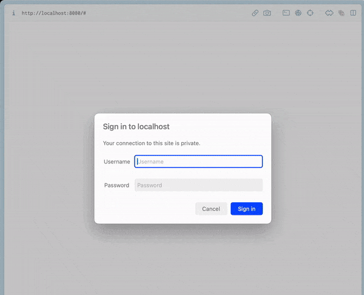

## file-server

A tiny http file storage system written in Go, auth feature is based on HTTP Basic authentication mechanism.

In real development environment, file transfer can be an issue, because there are many files need to be transferred from the personal machine to the development machine and vice versa. With file-server deploying as a server, you can manage (download, upload, delete, create folder) the files easily between different computers esaily.



## Usage

```shell
AUTH_USERNAME=admin AUTH_PASSWORD=778899 PORT=8080 go run .
```

## Acknowledgments

- [sgreben/http-file-server](https://github.com/sgreben/http-file-server)
- [mjpclab/go-http-file-server](https://github.com/mjpclab/go-http-file-server)